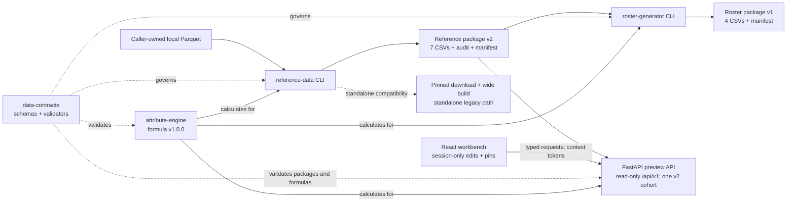
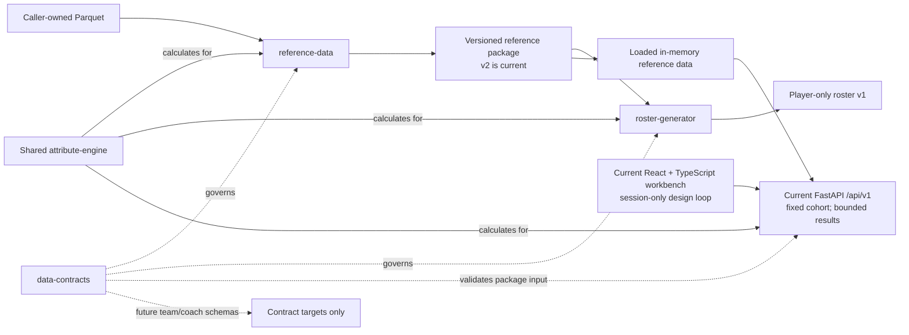
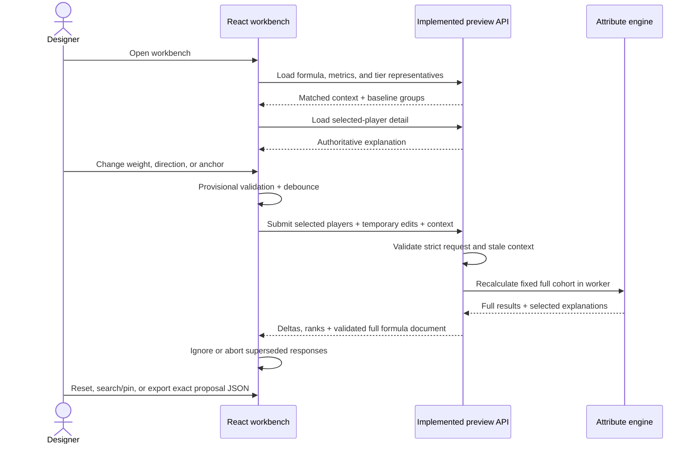

# Player Generator

## Current implementation and projected architecture

Technical presentation for engineers, architects, and product stakeholders

Implementation baseline: 2026-07-14, `agent/implement-epic-06`

> **Scope of “projected final state”:** the end of the currently approved seven-epic roadmap. It is
> not a projection of a complete league simulator.

---

# 1. Executive state

The batch-data foundation, read-only formula preview API, and interactive React formula workbench
are implemented. Future team and coach contracts remain planned.

| Capability | Current state | Roadmap state |
|---|---|---|
| Application boundaries and neutral domain language | Implemented | EPIC-01 complete |
| Local source registration and normalized reference package | Implemented | EPIC-02 complete |
| Declarative player attributes and reference attributes | Implemented | EPIC-03 complete |
| Deterministic player-only roster package | Implemented | EPIC-04 complete |
| Read-only formula preview API | Implemented | EPIC-05 complete |
| Interactive formula workbench | Implemented | EPIC-06 complete |
| Team and coach contract definitions | Proposed headers only | EPIC-07 ready |

**Delivery:** 14 of 15 user stories are complete. US-014 is ready and unstarted.

---

# 2. Architectural intent

The design separates three concerns that were previously coupled:

1. **Reference data** owns actual-player ingestion, identity reconciliation, normalization,
   provenance, and calibration data.
2. **Roster generation** owns independent generated identities, controlled statistical mutation,
   attribute calculation, and player-only publication.
3. **Formula exploration** combines a non-persistent read-only API over the same evaluator used by
   both batch paths with a React client for inspection, reversible tuning, comparison, and validated
   proposal export.

The governing principles are:

- published packages, not application internals, are integration boundaries;
- contracts and formulas are versioned data rather than implicit code conventions;
- one Python engine owns every rating calculation;
- deterministic inputs produce deterministic rows and content hashes;
- identity provenance never crosses from reference packages into roster packages;
- unsupported values and future domains remain absent rather than fabricated.

---

# 3. Monorepo and technology map

| Boundary | Current technology | Responsibility |
|---|---|---|
| `apps/reference-data` | Python 3.10+, pandas, PyArrow, PyYAML | Source registration, adapters, reconciliation, publication |
| `apps/roster-generator` | Python 3.10+, NumPy, pandas, Faker, PyYAML | Selection, mutation, generated identity, publication |
| `apps/formula-workbench/api` | Python 3.10+, FastAPI, Pydantic, Uvicorn | Read-only formula inspection, representative/player lookup, temporary previews, and validated proposal documents |
| `packages/data-contracts` | Python + packaged JSON schemas | CSV, formula, package-integrity, key, relationship, and semantic validation |
| `packages/attribute-engine` | Python, pandas, NumPy, declarative JSON | Metric derivation, percentile evaluation, ratings, explanations |
| `apps/formula-workbench` client | Node 22.12+, React 19, TypeScript 5.8, Vite 7 | API-backed inspection, session tuning, player comparison, search/pinning, and proposal export |
| Repository tooling | setuptools, npm workspaces, pytest, Ruff, mypy, Vitest, Testing Library | Build, packaging, tests, linting, type/build checks |

The five Python source roots install through one setuptools distribution while import-boundary tests
preserve their logical independence. Mypy is installed but is not currently an enforced check.

---

# 4. Current implemented architecture



Solid left-to-right edges carry data artifacts or HTTP requests. Engine edges identify a calculation
service called by each Python application; they do not reverse the applications' import direction.
The preview API is a reference-package consumer, and the React client consumes only its versioned
contract. Browser state is temporary and contains neither a rating evaluator nor active formula
configuration.

Enforced dependency direction:

- applications may import shared packages;
- shared packages never import applications;
- reference and roster applications never import each other;
- the roster generator never reads Parquet or imports a source adapter;
- the preview API imports neither data application, reads no raw Parquet, and writes no formula,
  package, or preset state.

---

# 5. Reference-data pipeline

```mermaid
flowchart LR
    register["Register local input"]
    registry["Ignored provenance registry"]
    verify1["Verify hash, rows, adapter"]
    adapt["Versioned source adapters"]
    reconcile["Reconcile identities"]
    canonical["Canonical relational model"]
    evaluate["Evaluate supported season cohorts<br/>nullable attributes for unsupported schedules"]
    stage["Stage + validate + hash"]
    publish["Atomic reference v2 publish"]

    register --> registry --> verify1 --> adapt --> reconcile --> canonical --> evaluate --> stage --> publish
```



Key strategies:

- files are referenced in place, never copied into the repository;
- registration records path, source type and ID, upstream metadata, license status, adapter version,
  SHA-256, row count, and processing timestamp;
- the file is reverified both before and after normalization to detect drift during a run;
- adapters are versioned anti-corruption layers for NBA and ESPN Parquet schemas;
- rows are sorted deterministically and written as UTF-8, LF-terminated, camelCase CSVs;
- source IDs and reconciliation evidence remain in reference data and never appear in roster
  output.

---

# 6. Identity reconciliation and canonicalization

Reference identity is deliberately conservative:

1. Group records by `(sourceType, sourcePlayerId)`.
2. Treat NBA identities as primary anchors.
3. Apply only manual links explicitly marked `reviewed: true`.
4. Otherwise normalize display names with Unicode NFKC, case folding, and alphanumeric filtering.
5. Match a non-primary identity only when the normalized name has exactly one primary candidate.
6. Audit ambiguous and unmatched identities instead of guessing.

Implementation details:

- a disjoint-set/union-find structure builds reconciliation groups;
- deterministic UUIDv5 values derive `playerId` from the prioritized identity anchor;
- another UUIDv5 derives `playerSeasonId` from `(playerId, season)`;
- configured per-field source precedence chooses canonical bio values;
- conflicting candidates, the selected value, and the applied rule remain in `audit.json`;
- every season-grain table must contain the exact same canonical key set.

This is a **fail-closed identity strategy**: lower match coverage is preferred to silent corruption.

---

# 7. Package contracts, provenance, and atomicity

The data exchange layer uses **package-as-interface** and **content-addressed provenance**.

| Package | Published content | Integrity metadata |
|---|---|---|
| Reference v2 | 7 contracted CSVs + audit + manifest; audit is manifest-governed | source hashes, adapter versions, formula version/hash, per-file rows/hashes, aggregate hash |
| Roster v1 | 4 contracted CSVs + manifest | reference package hash, formula version/hash, seed, configuration hash, per-file rows/hashes, aggregate hash |

The current producer publishes reference v2. The roster consumer accepts reference v1 and v2; it
validates v2's published attributes but recalculates roster attributes from generated statistics
using the requested formula.

Validation covers:

- exact directory entries and ordered headers;
- scalar types, finite values, null rules, bounds, dates, enums, and unique keys;
- foreign keys and exact cross-file key sets;
- exactly one traditional-stat row and one advanced-stat row per roster player, both for the same
  generated season, because attributes remain player-grain;
- manifest versions, row counts, file hashes, and aggregate content hashes;
- roster statistical identities and reference-identity leak prevention.

Publishers write contracted files to a same-parent staging directory, validate them, construct and
hash integrity metadata, then swap the package into place atomically with backup rollback. Roster
publication also revalidates the complete staged package. A partial or invalid package is never
published.

---

# 8. Declarative attribute engine

The engine is an application-independent functional core:

- formula schema version `1`; active formula version `1.0.0`;
- whitelisted metric kinds: input, ratio, stabilized percentage, and scheduled ratio;
- no arbitrary expressions or executable user code;
- finite real inputs or null only—no string, Boolean, complex, or temporal coercion;
- one season cohort per evaluation call;
- exact formula-document bytes are validated and hashed as one immutable snapshot;
- batch outputs and detailed explanations come from the same calculation.

Current outputs:

- 12 skill ratings: scoring, shooting, playmaking, ball security, rebounding, defense, stamina, and
  durability;
- `overall`, `impactPercentile`, `talentTier`, and `formulaVersion`;
- structured explanations containing raw and derived values, eligibility, cohort size, percentiles,
  normalized weights, contributions, composites, and final ratings.

That explanation model is the calculation-detail source exposed by the versioned preview API;
there is no separate “API calculation” or “UI calculation.” Temporary previews build explanation
trees only for selected players while still calculating every row needed for full-cohort ratings,
percentiles, and ranks.

---

# 9. Rating algorithm

For each season cohort:

1. Derive declared ratios, schedules, and stabilized shooting metrics.
2. Exclude an attribute row when games `< 20`, minutes `< 500`, or a required input is null.
3. Rank each component using `pandas.rank(method="average", pct=True)`.
4. Reverse only the percentile direction for lower-is-better metrics.
5. Normalize finite, nonnegative component weights and sum their contributions.
6. Rank the weighted composite within the same eligible cohort.
7. Piecewise-linearly interpolate the composite percentile through declared rating anchors.
8. Round half-even, clamp to `25..99`, and map overall to a versioned talent tier.

Shooting stabilization uses the full season before eligibility filtering:

```text
stabilizedPercentage =
  (made + leaguePercentage * priorAttempts) / (attempted + priorAttempts)
```

Current priors are 150 two-point attempts, 100 three-point attempts, and 75 free-throw attempts.
Nulls are excluded rather than median-filled, and ties receive their average rank.

---

# 10. Roster selection and mutation algorithm

The generator preserves statistical relationships by mutating **templates and primitives**, not
independent output columns.

1. Validate the exact reference package, formula compatibility, and input stability.
2. Evaluate complete season cohorts, then filter by configured seasons, games, minutes, complete
   formula output, and generation viability.
3. Sample templates with a seeded NumPy generator:

```text
samplingWeight = recencyWeight * minutes ** minutesWeightExponent
```

4. Infer one possession basis as the median of available positive total/per-100 implied values for
   points, assists, turnovers, steals, and blocks.
5. Apply one clipped lognormal volume factor to attempts and possessions.
6. Perturb shooting accuracy within `0..1` and event totals with configured lognormal noise.
7. Derive makes, points, rebounds, percentages, per-game, per-36, per-100, and advanced identities.
8. Generate seed-scoped names and IDs that do not reuse reference identities.
9. Recalculate attributes through the shared engine and publish only after all validation succeeds.

Default configuration selects 450 templates from 2022–2026 with replacement and favors recent,
higher-minute player-seasons.

---

# 11. Statistical consistency and privacy boundary

Semantic validation recomputes, among other relationships:

- `FGM = 2PM + 3PM`, `FGA = 2PA + 3PA`, and `PTS = 2*2PM + 3*3PM + FTM`;
- rebound totals, shooting percentages, per-game, per-36, and per-100 rates;
- net ratings from their offensive/defensive operands and defensive win shares per 36;
- effective field-goal and true-shooting percentages, valid through `1.5`;
- `assistTurnoverRatio = AST / max(TOV, 1)`;
- assist ratio and estimated turnover percentage using
  `FGA + 0.44*FTA + AST + TOV` as the shared play-ending denominator.

The roster publisher also rejects:

- provenance-like fields, source IDs, reference IDs, template IDs, team IDs, or row indexes;
- generated names or IDs that reuse a reference identity;
- a source-to-roster crosswalk of any kind.

The roster resembles calibrated reference statistics without claiming the identity of a sampled
reference player.

---

# 12. Patterns and engineering strategies

| Pattern or strategy | Concrete use |
|---|---|
| Bounded applications in a monorepo | Independent CLIs and frontend with coordinated contract versions |
| Shared kernel | `data-contracts` and `attribute-engine` contain cross-application invariants |
| Adapter / anti-corruption layer | Source schemas terminate inside versioned reference adapters |
| Contract-first integration | Machine-readable schemas govern package shape and relationships |
| Functional core, imperative shell | Pure metric/rating logic inside orchestrated I/O pipelines |
| Declarative strategy | Formula documents select metrics, directions, weights, eligibility, and anchors |
| Fail-fast / fail-closed | Unknown fields, incompatible versions, ambiguity, and invalid math stop publication |
| Deterministic simulation | Seeded RNG, stable ordering, immutable inputs, and recorded semantic configuration |
| Transaction-like publication | Stage, validate, hash, atomic swap, rollback |
| Content addressing | SHA-256 links sources, formulas, configuration, files, and packages |
| Privacy by boundary | Provenance remains reference-only; generated identity is independent |
| Server-authoritative thin client | React edits controls and presents API results; Python remains the only evaluator |
| Optimistic context identity | Package, formula, season, and cohort tokens guard every combined workbench view |
| Cancellable request pipeline | Debounce plus `AbortController` coalesces rapid edits and rejects superseded results |
| Session-scoped experimentation | In-memory edits and pins reset on reload; successful proposals download explicitly |

These patterns make a data pipeline auditable without coupling the applications back together.

---

# 13. Quality and delivery controls

Current automated checks:

- **pytest coverage** across applications, contracts, engine, architecture, entrypoints, and
  repository integrity;
- **Ruff** linting and import/order checks;
- **Vitest and Testing Library** coverage for the typed API client, formula editor, request lifecycle,
  and workbench components;
- **TypeScript `--noEmit` + Vite production build**;
- AST-based dependency tests that enforce application/package boundaries;
- deterministic package, failure-mode, semantic relationship, and identity-leak tests;
- preview API contract, startup, failure, concurrency, representative, selected-attribute rank,
  proposal-document, and maximum-cohort performance tests;
- `FILE_MANIFEST.sha256` coverage and hash verification for every other tracked file.

GitHub Actions runs Python 3.12 and Node 22.12 on every push and pull request. The repository
workflow requires each logical unit to be committed, pushed, and opened as a ready-for-review PR.

---

# 14. Current limitations and deliberate seams

| Current seam | Why it remains |
|---|---|
| Pinned remote download and wide processed build | Standalone legacy compatibility; not part of normalized roster flow |
| Reference formula input contract remains v1 | Reference v2 is additive and adds published attributes without changing statistical inputs |
| Aggregate player-season grain | Team stints and traded-player team identity are intentionally deferred |
| Conservative exact-name reconciliation | Avoids probabilistic identity corruption; ambiguous cases require review |
| Formula schedules cover 2021–2026 | Direct evaluation rejects unlisted schedules; reference publication preserves keys with nullable attributes |
| Defense is an estimate | Available inputs retain material team and context effects |
| Read-only local preview service | FastAPI is implemented; authentication, persistence, deployment, and production hosting remain out of scope |
| Session-only workbench | Reloading discards edits and pins; there are no named sessions, active writes, approvals, or deployment controls |
| Bounded formula controls | Existing weights, directions, anchors, and proposal version are editable; new attributes, metrics, eligibility, expressions, scales, and tiers are not |
| Player-only roster package | No approved generation rules exist for teams, coaches, contracts, or assignments |

Unsupported play-style and tendency ratings, speed/strength ratings, injury detail beyond
availability-based durability, personality, and finer defensive subskills remain absent rather than
populated with placeholders.

---

# 15. Projected end-of-roadmap architecture



The API is an interactive consumer of the existing Python evaluator, alongside the batch paths, and
the browser is its bounded client. Artifact flow remains source → reference publisher → versioned
package → consumers; engine arrows show shared calculation calls. The workbench never implements a
rating formula and never writes active configuration.

---

# 16. Implemented formula preview API

EPIC-05 implements a FastAPI application served by Uvicorn. API-owned strict Pydantic models publish
the version 1 OpenAPI contract and expose these read-only endpoints:

- `GET /api/v1/formula` and `GET /api/v1/metrics` for the active declarative formula and metric
  metadata;
- `GET /api/v1/players`, `GET /api/v1/players/representatives`,
  `GET /api/v1/players/search`, and `GET /api/v1/players/{playerId}` for bounded baselines,
  deterministic tier-stratified defaults, normalized partial-name/stable-ID search, and authoritative
  calculation detail;
- `POST /api/v1/previews` for request-local component weight, inverse-direction, and complete
  rating-scale anchor changes plus a proposed formula version for explicitly selected player IDs.

Preview responses return baseline and preview values, selected-attribute and overall rank movement,
raw inputs, percentiles, normalized weights, contributions, and the exact fully merged formula
document accepted by the shared validator. Every successful response identifies API version,
reference-package identity, active formula identity, configured season, and cohort size. Preview
requests must echo those package, formula, and season context tokens, so stale clients fail before
recalculation.

Implemented strategies and bounds:

- load one integrity-checked version 2 reference package and one explicitly configured season;
- recalculate and cache the active baseline over the complete season cohort, verifying published
  attributes when the package's published formula version and hash match the active formula exactly;
- reject more than 1,000 cohort rows, then bound representatives to at most five per tier, selected
  preview players and request pins to 25, and search results to 20;
- hold the baseline and preview cohort fixed so percentiles, selected-attribute rank, and overall rank
  movement remain comparable;
- materialize temporary explanation trees only for selected players, without filtering the metric,
  eligibility, percentile, rating, or rank populations;
- reject invalid or stale requests with no partial results and perform no writes to formulas,
  presets, or reference data;
- dispatch CPU-bound previews through an application-owned two-worker executor so lightweight
  reads remain responsive;
- enforce a 3,000 ms warm budget for the exact 1,000-player synthetic cohort.

---

# 17. Implemented workbench interaction



The sequence is the implemented local design loop. The API recalculates the active baseline and
verifies it against reference v2 attributes only when the published and active formula identities
match exactly. The browser adds these interaction behaviors without becoming a formula evaluator:

- inspect formula eligibility, cohorts, anchors, scales, versions, and calculation explanations;
- distinguish missing, excluded, unsupported, loading, empty, stale-version, and API-error states;
- edit only existing component weights, component direction, rating anchors, and proposal version;
- debounce preview requests, abort superseded requests, and discard prior results after failure or
  context drift;
- preview session-only changes with reset-per-attribute, reset-all, and exact validated JSON export;
- compare three highest-ranked eligible players from each populated talent tier by default, then
  search and add up to ten session-only pins;
- show selected-attribute and overall deltas, complete-cohort rank movement, largest gain/loss,
  missing input, exclusion, no change, and recalculation failure.

Closing or reloading discards edits and pins. Export serializes the server response's complete
`previewDocument`, making it directly usable by `roster-generator generate --formula`; it remains a
proposal, not persistence, approval, or deployment.

---

# 18. Projected final state—and its boundary

At the end of the approved roadmap, the project will provide:

- reproducible reference and player-only roster packages;
- one explainable formula engine across reference publication, roster generation, and previews;
- a read-only Python API for versioned formulas, search, calculation detail, and temporary previews;
- a React workbench for inspection, reversible tuning, player comparison, and proposal export;
- machine-validatable `teams.csv` and `coaches.csv` contract targets with stable IDs, membership by
  `teamId`, ISO 8601 dates, and 0–100 coach rating/preference scales.

It will **still not provide**:

- team or coach population, player-team assignment, contracts, salary, cap, or scheduling;
- authentication, multi-user state, named presets, or persistent formula editing;
- formula deployment or approval governance;
- production hosting or operations infrastructure;
- arbitrary expressions executed from the browser.

EPIC-07 is schema design only, and those files are not emitted by the player-only generator. Any
broader simulation capability requires new approved stories and, where it changes architecture or
policy, a new decision record.

---

# 19. Delivery sequence and migration strategy

```text
Delivered dependency path
  EPIC-01 → EPIC-02 → US-006 → US-007 → US-008
                                          ├─→ US-009  (completes EPIC-04)
                                          └─→ US-015  (completes EPIC-03)

Delivered interactive service
  EPIC-05 / US-010  read-only preview API

Delivered interactive client
  EPIC-06  inspect → preview → compare

Remaining independent contract lane
  EPIC-07 / US-014  team and coach schemas only
```

Epic numbering is roadmap grouping, not a strict chronological dependency graph: US-015 followed
the EPIC-04 package-consumer seam, while EPIC-07 does not depend on the API or workbench.

Migration has proceeded seam by seam: establish boundaries, replace the roster generator's
raw/wide-data coupling with a published package, extract calculations into a shared engine, add the
read-only API consumer, then add its session-only browser client. The plan permits a deliberate clean
v2 break while keeping additive reference v1 readable after v2 added attributes. Remaining roadmap
work defines future team and coach contracts without introducing population policy or new generator
behavior.

---

# 20. Risk controls and decision points

| Risk | Existing or planned control |
|---|---|
| Source schema or file drift | Versioned adapters; registration hashes and row counts; pre/post verification |
| Incorrect identity merges | Exact conservative matching; reviewed overrides; complete reconciliation audit |
| Formula drift across consumers | One engine; versioned document; exact byte hash; explanation regressions |
| Broken statistical relationships | Mutate primitives; derive dependents; semantic contract validation |
| Non-reproducible output | Seed, config and package hashes, stable rows/content hashes; deterministic roster manifest; reference timestamp excluded from content hash |
| Upstream data redistribution | Local ignored inputs; provenance/license metadata; no committed third-party data |
| Slow previews | 1,000-row cohort cap, bounded responses, selected-only explanation materialization, and a 3,000 ms warm test |
| Full-cohort accuracy versus preview latency | Fixed complete calculation cohort; only unreturned explanation objects are omitted |
| Baseline drift | Explicit package/formula/season tokens and published-attribute parity checks for exact formula matches |
| Duplicate API contracts | API-owned strict Pydantic models and one generated version 1 OpenAPI contract |
| Stale UI results | Implemented context-aware states, request debounce/cancellation, and fixed calculation cohorts |
| Unsafe formula editing | Implemented session-only controls, server validation, exact proposal export, and no active writes |
| Premature domain coupling | Team/coach contracts only; generation requires new approved scope |
| Premature domain detail | Validate contract semantics without inventing future population policy |

The implemented client consumes the versioned API contract, preserves server-authoritative
calculations and context-token handling, and keeps responsive design state separate from active
configuration. Persistence, approval, and deployment require future product and architecture
decisions rather than an extension of the current preview endpoint.

---

# Appendix A. Current public surfaces

```bash
# Reference data
reference-data register --source-type nba_playerstats /path/to/playerstats.parquet
reference-data register --source-type espn_player_details /path/to/player-details.parquet
reference-data publish --output /path/to/reference-v2
reference-data publish --formula /path/to/formula.json

# Roster data
roster-generator generate --reference-package /path/to/reference-v2
roster-generator generate --output /path/to/roster-v1 --seed 42

# Formula workbench client (run with the preview API below)
npm run workbench:dev

# Formula preview API (requires an ignored local reference v2 package)
formula-preview-api --config apps/formula-workbench/api/config/default.yaml
# equivalent: make formula-api

# Standalone legacy compatibility path
reference-data download --force
reference-data build

# Full validation
python -m pytest
python -m ruff check .
npm run workbench:test
npm run workbench:build
```

The normalized end-to-end batch path is `make all`. It publishes from already registered local
sources and then generates the roster; it does not download or register inputs automatically.

---

# Appendix B. Architecture records

Repository sources used for this presentation:

- [Project overview](../../README.md)
- [Version 2 plan and live story status](../planning/README.md)
- [Accepted architecture decisions](../planning/DECISIONS.md)
- [Current data contracts](../planning/DATA_CONTRACTS.md)
- [Current rating model](../RATING_MODEL.md)
- [Current player attribute formulas](../planning/ATTRIBUTE_FORMULAS.md)
- [Reference-data application](../../apps/reference-data/README.md)
- [Roster-generator application](../../apps/roster-generator/README.md)
- [Attribute-engine package](../../packages/attribute-engine/README.md)
- [Data-contracts package](../../packages/data-contracts/README.md)
- [Formula workbench client](../../apps/formula-workbench/README.md)
- [Formula preview API contract](../../apps/formula-workbench/api/README.md)
- [Formula API epic](../planning/epics/EPIC-05-formula-api.md)
- [Formula workbench epic](../planning/epics/EPIC-06-workbench.md)
- [Future domain-contract epic](../planning/epics/EPIC-07-domain-contracts.md)

Status labels in the deck are implementation claims only when their stories are marked `complete`.
